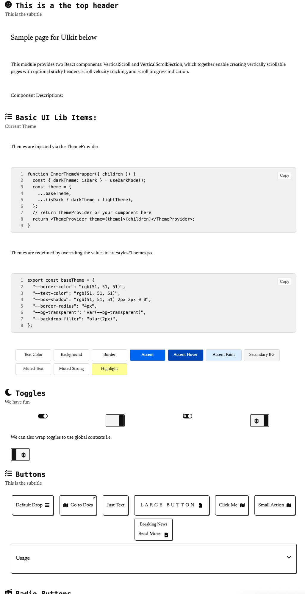
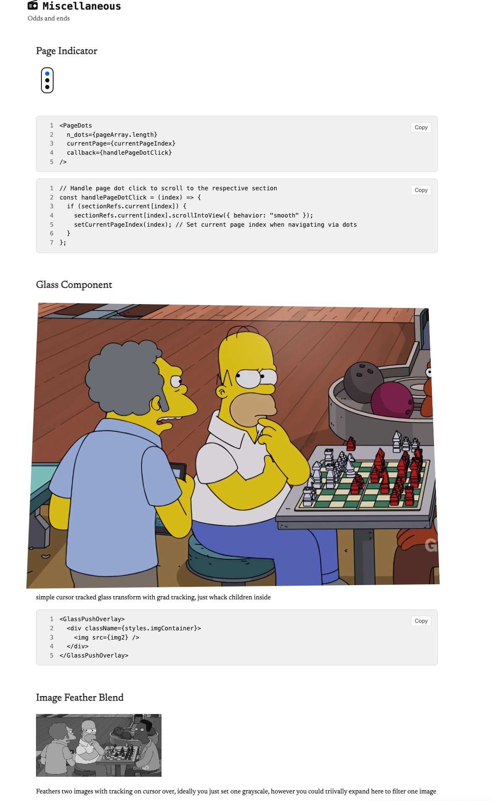

# 2of.io UI Library

Im just taking all of the bits I wrote from my little portfolio [2of.io](https://2of.io) project and flubbing them into a nice UI kit.

---
# 2-of-every-component-lib

A collection of reusable React UI components and utilities.

## Components Overview

| Component Name            | Status   | Description/Filler                |
|---------------------------|----------|-----------------------------------|
| CollapsableContainer      | ✅       | Expand/collapse content sections  |
| ImageModal                | ✅       | Modal for displaying images       |
| StandardButton            | ✅       | Customizable button               |
| StandardDropdown          | ✅       | Dropdown/select input             |
| StandardRadioButtons      | ✅       | Group of radio buttons            |
| StandardTextField         | ✅       | Text input field                  |
| StandardToggle            | ✅       | Toggle/switch input               |
| RowView                   | ✅       | Display rows of labeled content   |
| TestComponent             | 🟦       | Example/test component            |
| FancyCard                 | ⬜️       | (Filler) Card with shadow         |
| NotificationBanner        | ⬜️       | (Filler) Banner for notifications |
| LoadingSpinner            | ⬜️       | (Filler) Animated spinner         |

## Providers

| Provider Name      | Status   | Description                        |
|--------------------|----------|------------------------------------|
| PackageProviders   | ✅       | Wraps app with all providers       |
| DarkModeProvider   | ✅       | Provides dark mode context         |
| ThemeProvider      | ✅       | Provides theme context             |
| TooltipProvider    | ✅       | Provides tooltip context           |

## Wrappers

| Wrapper Name           | Status   | Description                      |
|------------------------|----------|----------------------------------|
| DarkModeWrapper        | ✅       | Wrapper for dark mode toggling   |

## Utilities

| Utility Name           | Status   | Description                      |
|------------------------|----------|----------------------------------|
| IconProvider           | ✅       | Provides icon context            |

## Snippets

| Snippet Name           | Status   | Description                      |
|------------------------|----------|----------------------------------|
| SnippetCode            | ✅       | Code snippet display component   |

---

**Legend:**  
✅ = Implemented  
🟦 = Example/Test  
⬜️ = Filler/Planned

---

## Usage

```js
import { StandardButton, ImageModal, RowView } from "2-of-every-component-lib";
```

Wrap your app with providers if needed:

```js
import { PackageProviders } from "2-of-every-component-lib";

<PackageProviders>
  <App />
Documentation is also available in /src/data  as JSON (it renders out to the / path anyway as below)








